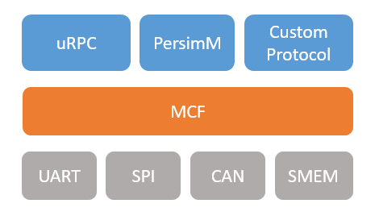
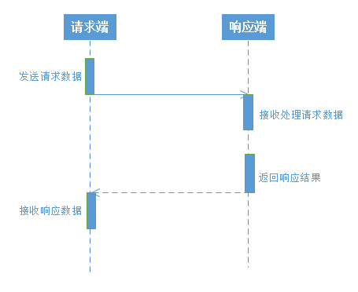
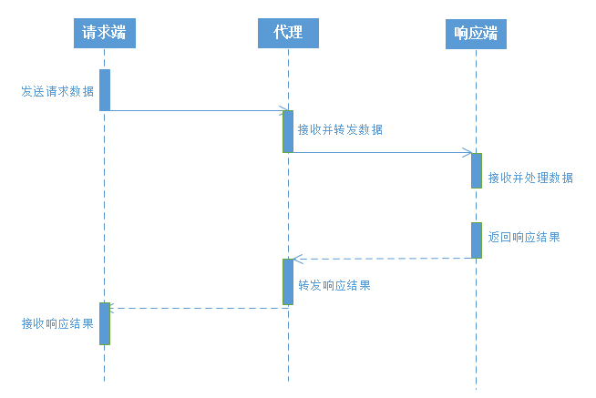
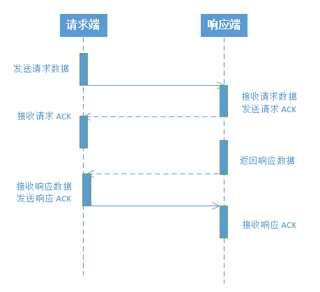
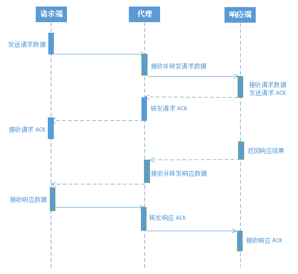
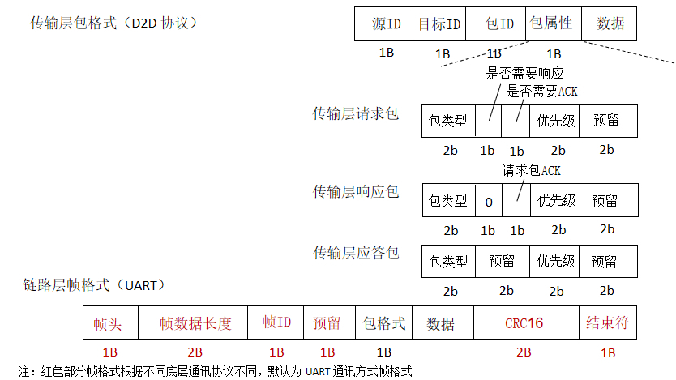
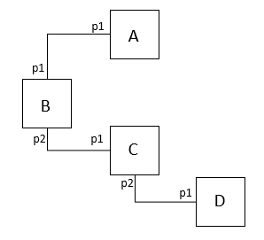

#  软件包介绍

MCF （Multi-machine Communication Framework），即多机通讯协议框架，是RT-Thread 自主研发的，支持通过指定数据格式在多个 MCU 之间进行数据传输的通讯协议。

## 目录结构

MCF 软件包目录结构如下所示：

```
MCF
├───docs 
│   └───figures                     // 文档使用图片
├───inc                             // 头文件目录
├───src                             // 源文件目录
│   ├───link                        // 数据链路层相关目录
│   ├───trans                       // 数据传输层相关目录
│   └───utils                       // 通用工具接口目录
│   LICENSE                         // 软件包许可证
│   README.md                       // 软件包使用说明
└───SConscript                      // 工程构建脚本
```
## 框架介绍



上图为 MCF 软件包系统框架图，

- 对上层 MCF 作为基于数据传输的通讯协议模型，可以实现多种协议支持，如 uRPC，PersimM，移植自定义的协议类型；
- 对下层可以对接多种数据通讯方式，如 UART、SPI、CAN 等，方便多设备数据通讯。

MCF  软件包内部主要分为两层：传输层和链路层：

- 数据传输层：主要用于对传输数据进行封包、加密、压缩，并且支持数据的重传； 
- 链路层：存放注册的底层通讯协议对象，用于链路帧的封包和拆包，数据完整性检测，数据收发等； 

## 功能特点

MCF 软件包功能特点：

- **面向无连接的设备通讯方式**

  MCF 软件包实现多个设备之间数据通讯功能，为降低资源占用，软件包实现面向无连接的设备通讯方式，并且通过 ACK 等方式确保数据传输实时性和可靠性。

- **支持异步请求方式，多线程数据处理**

  软件包支持多线程异步接收请求，支持同时处理不同请求数据并支持返回响应数据。

- **支持 ACK 应答机制**

  如果需要确保数据响应实时性，可以开启软件包中 ACK 功能，ACK 功能可应用于请求或者响应的数据发送，数据发送完成需要在指定时间中获取 ACK 响应数据，否则数据发送返回失败。

- **支持错误重传功能**

  软件包支持数据发送失败或数据丢失之后数据重传功能，确保数据发送安全。

- **支持 CRC 校验功能**

  为了确保数据发送完整性，软件包支持链路层帧数据 CRC 数据校验功能，在收发数据时需要对帧数据进行校验。

- **支持广播数据发送**

  多机通讯时，广播数据可以发送到所有连接的设备上。

- **支持数据加密压缩功能**

  软件包支持多种数据加密压缩功能，确保多机通讯时数据安全性。

- **可适配多种底层协议**

  软件包链路层支持适配多种底层通讯协议，如 UART、SPI、CAN 等，目前支持通过 UART 串口进行数据通讯。

## 功能介绍

### 数据通讯方式

MCF 数据通讯方式基于请求/响应的模型，即多机通讯时请求方发送数据请求，响应方接收到请求方数据之后进行数据解析，并在指定时间内返回响应数据，完成一次数据通讯过程。

基本数据通讯流程如下所示：



数据传输过程中如果获取的数据目标地址不是自己，可以通过代理的方式发送给指定地址的设备，下面是通过代理方式的数据通讯流程：



如果发送的数据对响应的实时性以及安全性有要求，可以通过发送需要 ACK 响应的数据。该模式通过在较短时间内返回 ACK 数据方式完成数据收到状态同步更新。

如下为带 ACK 功能的数据通讯流程：





### 数据发送格式

MCF 软件包内部自定义了数据通讯时数据传输格式。根据 MCF 不同分层，数据格式定义格式如下所示：



**传输层包介绍（D2D 协议）**

- 源 ID        （1 byte）：本地设备 ID，每个设备唯一；
- 目标 ID     （1byte）：本地设备连接的远端设备唯一 ID；
- 包 ID         （1byte）： 每个发送的传输层包的唯一 ID，可用于数据重传；
- 包属性     （1 byte）：包括包的类型、是否需要响应，是否需要 ACK ，优先级等信息;
  - 包类型          （2 bits）：请求包（00）、响应包（01）、应答包（10）；
  - 是否需要响应（1 bit）：只有请求包中包含，其他包为 0；
  - 是否需要 ACK（1 bit）：请求包和响应包包含，应答包为 0；
  - 优先级          （2 bits）：数据包发送优先级；
  - 预留              （2 bits）
- 数据                                      ：上层应用层传入数据；

**链路层帧介绍（UART）**

- 帧头              （1 byte）：用于识别链路层帧起始；
- 帧数据长度 （2 bytes）：用于接收指定长度帧数据；
- 帧 ID             （1 byte）：用于区分不同的帧；
- 预留              （1 byte）
- 包格式          （1 byte）：上层协议类型（**d2d、arp** 等），用于区分数据处理方式；
- 数据                                ：上层传输层传入数据；
- CRC16       （2 bytes）：CRC16 检验值，用于检测帧传输是否正确；
- 结束符         （1 byte）：方便获取和解析 MCF 帧数据；

针对传输层和链路层数据传输格式，在发送数据时 MCF 软件包会根据应用层传入的数据类型和参数自动拼接并发送。用户在使用时只需要关心如下几个参数：

- **包类型**：一般在发送数据时指定，应用层设置请求类型和响应类型两种；
- **是否需要响应数据**：如果不设置，则请求数据不返回响应数据；
- **是否需要 ACK**：如果不设置，则请求数据不使用 ACK 应答方式进行状态同步；

## 链路层多设备管理和通讯

MCF 链路层支持接入多种类型的数据通讯方式，目前已经支持通过 UART 串口通讯方式，即将支持的通讯方式有 SPI、CAN 等。

MCF 软件包中每个设备有唯一的设备 ID（dev_id），用于数据的请求、响应和 ACK。每个设备底层端口都有一个对应的端口 ID（port_id）。MCF 软件包中包含一个 ARP 列表，用于管理设备 ID 和端口 ID 对应关系， MCF 中传输层通过设备 ID 在 ARP 列表中查找端口 ID ，再通过端口 ID 确定底层链路层传输方式。

上述 ARP 列表的方式，可以实现 MCF **应用层无感知的底层数据通讯**，并且支持一个设备通过底层端口接入多个设备。

如下图所示，A、B、C、D 四个设备，B、C 设备上分别连接两个设备，四个设备上都运行 MCF  软件包。



 则对应的 ARP 列表如下所示：

- A 设备对应表：p1 --> B，p1 --> C，p1 --> D
- B 设备对应表：p1 --> A，p2 --> C，p2 --> D
- C 设备对应表：p1 --> B，p1 --> A，p2 --> D
- D 设备映射表：p1 --> C，p1 --> B，p1 --> A

通过ARP 列表，可以直观的确定当前设备和目标设备之间通讯使用哪种底层通讯协议，方便应用层使用方式。

## 通讯异常处理

MCF 中提供多种数据传输异常处理方式，确保数据传输安全性和稳定性。

- 请求超时处理：

|          场景           |    请求端     |       响应端       |
| :---------------------: | :-----------: | :----------------: |
| 响应端接收请求服务出错  |   重发请求    |       无动作       |
| 请求端接收 ACK 应答出错 |   重发请求    |   发送 ACK 应答    |
| 请求端接收请求结果出错  |    无动作     | 重发缓存的请求结果 |
| 响应端接收 ACK 应答出错 | 发送 ACK 应答 | 重发缓存的请求结果 |

- 帧长度限制：默认设置最大帧、最小帧长度限制，丢弃数据；
- 帧结束符判断：接收端在当前接收的全部数据中收缩帧结束符。如果有，丢弃之前的脏数据；如果没有，继续等待接收数据；
- CRC 错误：接收端检测帧数据 CRC 错误，丢弃数据；

## 通讯安全处理

MCF 默认支持多数据加密、压缩功能，确保数据传输安全可靠，降低数据传输资源消耗。

- 加解密方式：AES256
- 压缩方式：FastLZ

## 资源占用统计

下面为 MCF 软件包各功能资源占用统计表（传输数据大小 1K ）：

| 功能                   | ROM      | 静态 RAM | 动态 RAM |
| ---------------------- | -------- | -------- | -------- |
| 所有功能都关闭         | 8.92 KB  | 198 B    | 4.63 KB  |
| 只开启 ACK 功能        | 9.52 KB  | 198 B    | 4.63 KB  |
| 只开启 CRC 功能        | 9.16 KB  | 198 B    | 4.63 KB  |
| 只开启请求自动响应功能 | 10.01 KB | 198 B    | 7.05 KB  |
| 开启加密压缩           | 10.25 KB | 198 B    | 7.25 KB  |
| 开启所有功能           | 11.96 KB | 198 B    | 7.25 KB  |