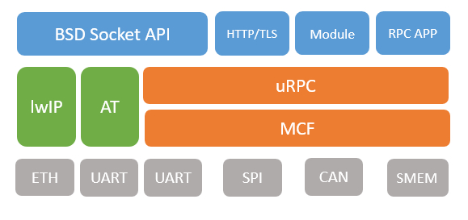

# uRPC 轻量级远程过程调用协议 

## 1、介绍

uRPC（Ultra-lightweight Remote Procedure Call Framework），即轻量级远程过程调用协议框架，是 RT-Thread 基于 MCF（Multi-machine Communication Framework）框架自主研发的多机通讯协议框架，uRPC 协议将应用层功能和特性以服务（Service）的形式对外提供，实现多设备之间远程服务调用功能，该方式可以有效的简化设备功能实现和调用方式，极大的降低设备资源占用。

uRPC 软件包特性：

- 实现远程服务调用功能，请求端无感知功能调用；
- 支持并发服务请求和响应功能；
- 提供简单的自定义服务添加方式；
- 支持服务静态和动态注册；
- 支持 cJSON、blob 格式数据传输；
- 资源占用低，适用于资源环境受限场景；

### 1.1 框架介绍



上图为 uRPC 软件包在系统中框架介绍

- 对上 uRPC 软件包可以对接多种应用功能，如常见的 BSD Socket API、HTTP、MQTT等，将这些功能和特性以注册服务的方式添加支持，用于远程调用功能。
- 对下 uRPC 软件包直接依赖 MCF 软件包，通过 MCF 可以同时支持多种数据通讯方式，如 UART、API、CAN 等，可灵活应用与多种多机通讯场景。

### 1.2 目录结构

uRPC 软件包目录结构如下所示：

```
urpc
├───req                             // 服务请求目录
│    └───urpc_req_sample.c          // 服务请求示例文件
├───rsp                             // 服务注册和响应目录
│    └───urpc_rsp_sample.c          // 服务注册示例文件
│   urpc.c                          // 源文件
│   urpc.h                          // 头文件
│   LICENSE                         // 软件包许可证
│   README.md                       // 软件包使用说明
└───SConscript                      // 工程构建脚本
```
### 1.3 许可证

uRPC 软件包遵循 Apache-2.0 许可，详见 LICENSE 文件。

### 1.4 依赖

- RT-Thread 3.0+
- [cJSON 软件包](https://github.com/RT-Thread-packages/cJSON)（如果开启 cJSON 格式数据支持）

## 2、获取软件包

使用 uRPC 软件包需要在 RT-Thread 的包管理中选中它，具体路径如下：

```shell
RT-Thread online packages
  IoT - internet of things  --->
    [*] uRPC: Ultra-lightweight Remote Procedure Call Framework
    [ ]   Enable JSON data format support
    [ ]   Enable samples
          Version (latest)  --->
```
- **Enable JSON data format support**：开启 cJSON  格式数据支持；
- **Enable samples**：开启示例文件；
- **Version**：配置软件包版本。

## 3、使用方式

使用 uRPC 软件包在多设备之间完成服务远程调用，一般需要完成如下流程：

- **注册服务**

服务注册分为动态注册和静态注册，动态注册以服务链表形式管理，静态注册服务存储在 SECTION 段中。以静态注册为例，服务使用之前需要如下注册：

```c
struct urpc_blob *print_test(struct urpc_blob *input)
{
    LOG_I("uRPC print test!");

    return RT_NULL;
}
/* 静态注册名称为 print_test 的服务 */
URPC_SVC_STATIC_REGISTER(print_test);
```

- **修改链接脚本（GCC 编译环境）**

uRPC 静态注册服务时，导出的服务存放在 `uRPCSvcTab` 代码段中，如果是 GCC 编译器需要在连接脚本中设置该代码段，如果在 IAR 和 MDK 编译器下则不需要添加。

可以 GCC 链接脚本的 `.text` 中，增加 `uRPCSvcTab` 代码段的定义，格式如下所示：

```c
/* section information for uRPC */
. = ALIGN(4);
__uRPCSvcTab_start = .;
KEEP(*(uRPCSvcTab))
__uRPCSvcTab_end = .;
```

- **请求服务**

一个设备注册服务并初始化完成之后，另一个设备可以请求服务，执行 `urpc_svc_exec` 函数通过指定的服务名称，请求连接设备注册的服务，并获取响应结果，响应结果的类型支持 blob 类型和 json 类型。

```c
int urpc_print_test(void)
{
    int result = 0;
    /* 当前设备连接的对等方设备 ID */
    uint8_t urpc_dst_id = 2;

    /* 请求服务名称为 "print_test" 的服务，需要数据请求 ACK 应答，不需要返回响应数据 */
    result = urpc_svc_exec(urpc_dst_id, "print_test", URPC_SVC_FLAG_NEED_ACK, RT_NULL, RT_NULL, RT_WAITING_NO);
    if (result != RT_EOK)
    {
        LOG_E("uRPC service execute failed(%d).", result);
        return result;
    }

    /* 请求服务执行成功 */
    LOG_I("uRPC wait test success.");

    return 0;
}
```

## 4、接口介绍

### uRPC 初始化

```c
int urpc_init(uint8_t id);
```

该接口用于初始化 uRPC 软件包功能。

| 参数     | 描述        |
| :------- | :---------- |
| id       | 当前设备 ID |
| **返回** | **描述**    |
| 0        | 初始化成功  |
| != 0     | 初始化失败  |

### uRPC 启动

```c
void mcf_init(void);
```

该接口用于启动 uRPC 功能，开始服务的请求和响应。

### 服务动态注册

```c
int urpc_svc_register(const char *name, urpc_svc_fn svc_fn);
```

该接口用于动态注册服务。

| 参数     | 描述        |
| :------- | :---------- |
| name     | 注册的服务名称 |
| svc_fn   | 服务请求执行回调函数 |
| **返回** | **描述**    |
| 0        | 服务注册成功  |
| != 0     | 服务注册失败  |

### 服务动态注册

```c
URPC_SVC_STATIC_REGISTER(name)
```

该接口用于静态注册服务到 SECTION 段中，传入的名称为服务请求执行回调函数名称。

| 参数     | 描述        |
| :------- | :---------- |
| name     | 注册的服务名称 |

### 服务执行

```c
int urpc_svc_exec(uint8_t dst_id, const char *name, uint16_t flag,
        struct urpc_blob *input, struct urpc_blob *output, int32_t timeout);
```

该接口用于在超时时间内向指定设备请求指定名称服务，并返回响应结果。

| 参数     | 描述        |
| :------- | :---------- |
| dst_id   | 目标设备 ID |
| name     | 请求服务名称 |
| flag     | 请求服务状态 |
| input    | 请求输入数据对象 |
| output   | 接收响应数据对象 |
| timeout  | 服务执行超时时间 |
| **返回** | **描述**    |
| 0        | 服务执行成功  |
| != 0     | 服务执行失败  |

### 静态创建 blob 数据对象

```c
struct urpc_blob *urpc_blob_make(struct urpc_blob *blob, void *buf, size_t len, size_t size);
```

该接口用于静态创建 blob 数据对象，设置相关信息。常用于请求服务和响应服务数据的创建。

| 参数     | 描述        |
| :------- | :---------- |
| blob     | 数据对象指针     |
| buf      | 数据缓冲区指针 |
| len      | 数据缓冲区已使用长度 |
| size      | 数据缓冲区最大数据长度 |
| **返回** | **描述**    |
| !=RT_NULL  | 数据对象创建成功   |
|   RT_NULL  | 数据对象创建失败   |

### 动态创建 blob 数据对象

```c
struct urpc_blob *urpc_blob_alloc(size_t size);
```

该接口用于动态创建 blob 数据对象。

| 参数     | 描述        |
| :------- | :---------- |
| len      | 数据缓冲区最大数据长度 |
| **返回** | **描述**    |
| !=RT_NULL  | 数据对象创建成功   |
|   RT_NULL  | 数据对象创建失败   |

### 释放动态创建的 blob 数据对象

```c
void urpc_blob_free(struct urpc_blob *blob);
```

该接口用于释放动态申请的数据对象。

| 参数     | 描述        |
| :------- | :---------- |
| blob      | 数据对象指针 |

### 创建带响应结果的数据对象

```c
struct urpc_blob *urpc_create_result_blob(uint8_t result_code);
```

该接口通过传入的响应结果码创建数据对象，常用于服务请求注册和响应端。

| 参数     | 描述        |
| :------- | :---------- |
| len      | 数据缓冲区最大数据长度 |
| **返回** | **描述**    |
| !=RT_NULL  | 数据对象创建成功   |
|   RT_NULL  | 数据对象创建失败   |

### 获取数据对象中的响应结果码

```c
uint8_t urpc_result_code_get(struct urpc_blob* blob);
```

该接口用于获取带响应结果的数据对象中的响应结果码，常用于服务请求执行端，该响应结果码可在注册端自定义。

| 参数     | 描述        |
| :------- | :---------- |
| blob      | 带响应结果的数据对象 |
| **返回** | **描述**    |
| result_code  | 响应结果码   |

### cJSON 格式数据转 blob 数据对象

```c
struct urpc_blob *urcp_json_to_blob(cJSON *json, struct urpc_blob *blob);
```

该接口可将 JSON 格式对象转化为 blob 格式数据对象。

| 参数     | 描述        |
| :------- | :---------- |
| json      | 待转化的 JSON 数据对象指针 |
| blob      | 转化的 blob 数据对象指针 |
| **返回** | **描述**    |
| !=RT_NULL  | 数据对象转化成功   |
|   RT_NULL  | 数据对象转化失败   |

###  blob 数据对象转 json 格式数据

```c
cJSON *urpc_blob_to_json(struct urpc_blob *blob, cJSON *json);
```

该接口可将 JSON 格式对象转化为 blob 格式数据对象。

| 参数     | 描述        |
| :------- | :---------- |
| blob      | 待转化的 blob 数据对象指针 |
| json      | 转化的 JSON 数据对象指针 |
| **返回** | **描述**    |
| !=RT_NULL  | 数据对象转化成功   |
|   RT_NULL  | 数据对象转化失败   |

## 5、示例使用

### 准备工作

通过 ENV 配置开启软件包示例代码功能支持。

```c
  [*] uRPC: Ultra-lightweight Remote Procedure Call Framework
    [*]   Enable samples
```

开启软件包示例配置之后，使用 `pkgs --update` 命令更新下载软件包，并编译功能。

### 启动例程

uRPC 软件包主要功能是实现多机通讯中的远程调用，该示例需要两个设备配置完成，两个设备分别为服务的注册方（响应方）和请求方。

例程导出如下几个 FinSH 命令，用于软件包初始化和服务请求和响应：

- urpc_init：uRPC 软件包初始化
- urpc_print_test：测试日志打印服务功能
- urpc_send_test：测试服务发送和响应功能
- urpc_wait_test：测试并发服务发送功能
- urpc_json_test：测试 json 数据发送功能

**服务注册设备示例**

服务注册设备在 `urpc_rsp_sample.c` 中静态注册了多种测试服务，请求方可以通过注册的服务名称请求服务。

服务注册端，直接执行 `urpc_init` 命令初始化和启动 uRPC 软件包，然后可以等待请求方服务。

```c
/* 初始化 UART2 设备，当前设备 ID 为 2，连接的设备 ID 为 1 */
msh >urpc_init uart2 2 1
[12540] I/mcf.link: MCF link port(2) register successfully.
[12607] I/mcf.trans: MCF(V0.1.0) initialized successfully.
[12613] I/urpc: uRPC(V0.1.0) initialize successfully.
[12619] I/mcf.trans: MCF protocol started successfully.
```

**服务请求设备示例**

服务请求设备在 `urpc_req_sample.c` 中导出测试命令，用于服务请求和获取响应数据。

执行 `urpc_init` 命令初始化和启动 uRPC 软件包

```c
/* 初始化 UART2 设备，当前设备 ID 为 1，连接的设备 ID 为 2 */
msh >urpc_init uart2 2 1
[12540] I/mcf.link: MCF link port(2) register successfully.
[12607] I/mcf.trans: MCF(V0.1.0) initialized successfully.
[12613] I/urpc: uRPC(V0.1.0) initialize successfully.
[12619] I/mcf.trans: MCF protocol started successfully.
```

可以执行 `urpc_print_test`、`urpc_send_test` 、`urpc_wait_test` 或`urpc_json_test` 执行请求服务。

- 日志打印服务功能测试

  该功能测试请求不服请求数据，不需要服务响应功能。
  
  请求方设备日志：
  
  ```c
  msh >urpc_print_test
  [52496] I/urpc.sample: uRPC wait test success.
  ```
  
  响应方设备日志：
  
  ```c
  msh >[20384] I/urpc.sample: uRPC print test!              // 接收请求服务并打印相关日志
  ```

- 数据发送和接收服务测试

  该功能测试带请求数据，需要服务响应数据功能。

  请求方设备日志：

  ```c
  msh >urpc_send_test                                                         // 请求服务命令
  [235940] I/urpc.sample: uRPC receive data: uRPC receive and response data!  // 打印响应数据
  ```

  响应方设备日志：

  ```c
  [203896] I/urpc.sample: data test service receive data: urpc send data!     // 接收并打印请求数据
  ```

- json 格式数据收发测试

  该功能用于测试 json 格式数据在服务中收发功能。
  
  请求方设备日志：
  
  ```c
  msh >urpc_json_test
  [962494] I/urpc.sample: uRPC json test success.
  ```
  
  响应方设备日志：
  
  ```c
  [930785] I/urpc.sample: receive json data: {"data":"test","number":1024}
  ```

- 并发服务发送功能测试

  该功能用于测试多服务并发功能，MCF 软件包中 `The maximum number of thread pools requested` 配置选项为最大同时支持并发服务处理数量（默认为2，即同时支持两条服务请求执行），根据实际应用需求定义。
  
  请求方设备日志：
  
  ```c
  msh >urpc_wait_test                                 // 连续请求两次服务
  [730595] I/urpc.sample: uRPC wait test success.
  msh >urpc_wait_test
  [733090] I/urpc.sample: uRPC wait test success.
  ```
  
  响应方设备日志：
  
  ```c
  [767382] I/urpc.sample: wait test service receive data: urpc send data!   //两个服务响应依次执行
  [769876] I/urpc.sample: wait test service receive data: urpc send data!
  ```

## 6、注意事项

- uRPC 中发送数据的最大长度取决于依赖的 MCF 软件包中设置的最大数据长度支持，可根据实际需求配置；

## 7、联系方式

- 维护：chenyong@rt-thread.com
- 主页：https://github.com/RT-Thread-packages/urpc